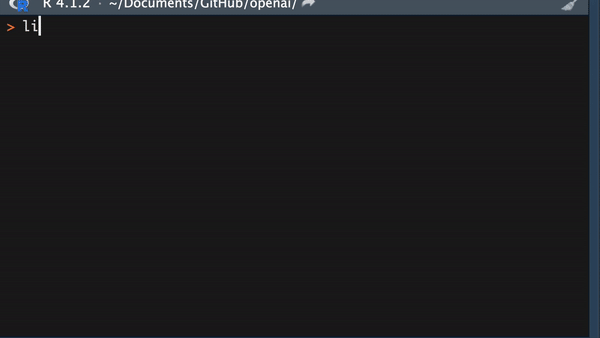

<!-- README.md is generated from README.Rmd. Please edit that file -->

# openai

<!-- badges: start -->
<!-- badges: end -->

The openai package provides R scripts to use the [Open AI
API](https://platform.openai.com/docs/api-reference/). In order to get
started you will need to sign up for an account at
<https://openai.com/>. You will also need to set up billing to use the
API.

## Installation

You can install the development version of openai from
[GitHub](https://github.com/samterfa/openai) with:

``` r
# install.packages("devtools")
devtools::install_github("samterfa/openai")
```

## Set Up

API calls are authenticated using your [API
keys](https://beta.openai.com/account/api-keys). The environment
variables set below are consulted while making each call.

``` r
Sys.setenv(openai_organization_id = {your_organization_id})
Sys.setenv(openai_secret_key = {your_secret_key})
```

More details on authentication can be found
[here](https://platform.openai.com/docs/api-reference/authentication).

## Examples

#### Retrieve the currently available models used to generate text.

``` r
library(openai)

list_models()$data %>% 
  dplyr::bind_rows()
#> # A tibble: 72 × 4
#>    id                            object    created owned_by       
#>    <chr>                         <chr>       <int> <chr>          
#>  1 text-search-babbage-doc-001   model  1651172509 openai-dev     
#>  2 gpt-4                         model  1687882411 openai         
#>  3 gpt-3.5-turbo-16k             model  1683758102 openai-internal
#>  4 curie-search-query            model  1651172509 openai-dev     
#>  5 text-davinci-003              model  1669599635 openai-internal
#>  6 text-search-babbage-query-001 model  1651172509 openai-dev     
#>  7 babbage                       model  1649358449 openai         
#>  8 gpt-3.5-turbo-1106            model  1698959748 system         
#>  9 babbage-search-query          model  1651172509 openai-dev     
#> 10 text-babbage-001              model  1649364043 openai         
#> # ℹ 62 more rows
```

#### Create a completion request using the davinci engine.

``` r
create_chat_completion(
  model = 'gpt-3.5-turbo', 
  messages = 
    list(
      list(role = 'system', content = 'You are a helpful assistant.'),
      list(role = 'user', content = 'Who won the world series in 2020?'),
      list(role = 'assistant', content = 'The Los Angeles Dodgers won the world series in 2020.'),
      list(role = 'user', content = 'Where was it played?')
    )
)$choices[[1]]$message$content
#> [1] "The 2020 World Series was played in Arlington, Texas at the Globe Life Field, which is the new home stadium of the Texas Rangers."
```

#### Generate an image based on a prompt.

``` r
img_url <-
  create_image(
    model = 'dall-e-3',
    prompt = 'a white siamese cat', 
    n = 1, 
    size = '1024x1024')$data[[1]]$url

knitr::include_graphics(img_url)
```


#### NEW! Ask a question about an image.

``` r
openai::create_chat_completion(
  model = 'gpt-4-vision-preview',
  messages = list(
    list(role = 'user', 
         content = list(
           list(
             type = 'text',
             text = 'What is this a picture of?'
           ),
           list(
             type = 'image_url',
             image_url = list(
               url = img_url
             )
           )
         )
    )
  ), 
  max_tokens = 1000
)$choices[[1]]$message$content
#> [1] "This is a highly detailed, idealized digital artwork or photograph of a cat with striking blue eyes surrounded by lush greenery, flowers, and butterflies. The lighting is warm and soft, highlighting the cat's face and giving the scene an almost magical or ethereal quality. The cat appears to be a Ragdoll, characterized by its large blue eyes, pointed color scheme, and luxurious semi-longhair coat. The image composition is created to evoke a sense of tranquility and harmony with nature."
```

#### Use the included addin to code collaboratively with a model.



Access it via the Addins menu, or by Tools -\> Addins -\> Browse Addins.
Search for “openai”.
